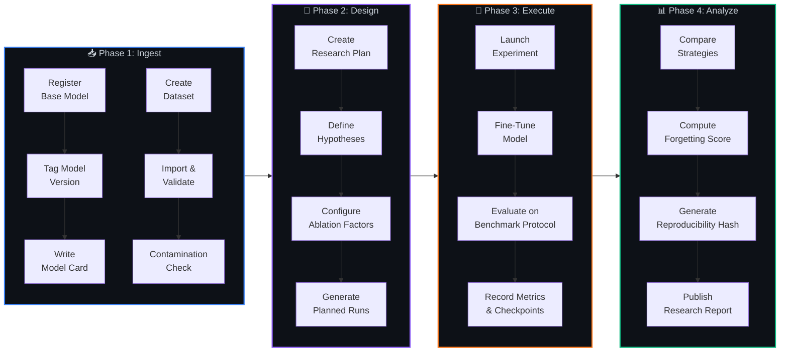
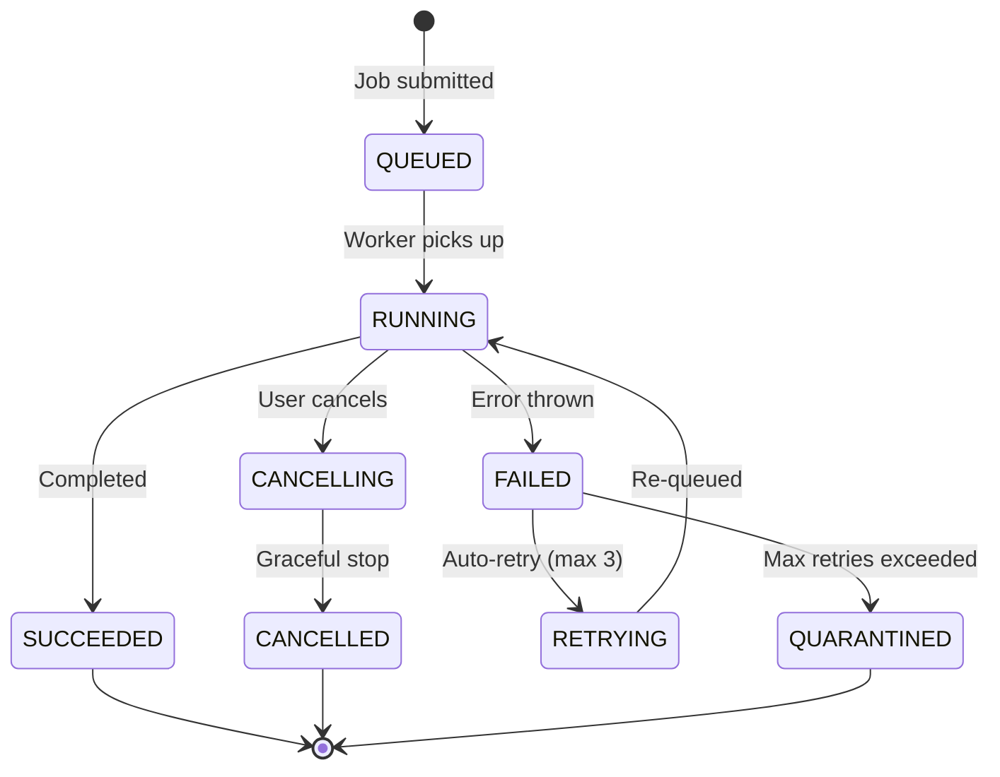

<div align="center">

```
 ██████╗ ██████╗ ███╗   ██╗████████╗██╗███╗   ██╗██╗   ██╗ █████╗ ███╗   ███╗██╗     
██╔════╝██╔═══██╗████╗  ██║╚══██╔══╝██║████╗  ██║██║   ██║██╔══██╗████╗ ████║██║     
██║     ██║   ██║██╔██╗ ██║   ██║   ██║██╔██╗ ██║██║   ██║███████║██╔████╔██║██║     
██║     ██║   ██║██║╚██╗██║   ██║   ██║██║╚██╗██║██║   ██║██╔══██║██║╚██╔╝██║██║     
╚██████╗╚██████╔╝██║ ╚████║   ██║   ██║██║ ╚████║╚██████╔╝██║  ██║██║ ╚═╝ ██║███████╗
 ╚═════╝ ╚═════╝ ╚═╝  ╚═══╝   ╚═╝   ╚═╝╚═╝  ╚═══╝ ╚═════╝ ╚═╝  ╚═╝╚═╝     ╚═╝╚══════╝
```

### 🧠 Production-Grade LLM Continual Learning Research Platform

[](https://python.org)
[](https://fastapi.tiangolo.com)
[](https://nextjs.org)
[](https://react.dev)
[](https://sqlmodel.tiangolo.com)
[](https://redis.io)
[](https://docs.docker.com/compose/)
[](LICENSE)

<br/>

> **Fine-tune large language models. Measure catastrophic forgetting. Compare mitigation strategies.**
> **All in one reproducible, auditable, production-grade platform.**

<br/>

[🚀 Quick Start](#-quick-start) · [🏗️ Architecture](#%EF%B8%8F-system-architecture) · [📡 API Reference](#-api-reference) · [🔬 Research Pipeline](#-research-pipeline) · [🛡️ Security](#%EF%B8%8F-security-model) · [📖 Docs](#-documentation)

</div>

---

## ✨ What is ContinuaML?

**ContinuaML** is a full-stack research platform purpose-built for **continual learning** (CL) experiments on large language models. It solves the core problem every ML researcher faces when studying catastrophic forgetting:

```
┌─────────────────────────────────────────────────────────────────────────┐
│                                                                         │
│   🤖 Model learns Task B  ───►  📉 Model forgets Task A               │
│                                                                         │
│   This is CATASTROPHIC FORGETTING — and ContinuaML helps you           │
│   measure it, mitigate it, and reproduce your findings.                │
│                                                                         │
└─────────────────────────────────────────────────────────────────────────┘
```

### 🎯 Core Capabilities

| Capability | Description | Status |
|:---|:---|:---:|
| 🏛️ **Model Registry** | Register, version, and track LLMs with model cards | ✅ Live |
| 📦 **Dataset Management** | Import, validate, version, and check contamination | ✅ Live |
| 🧪 **Experiment Engine** | Launch fine-tuning and evaluation runs with full lineage | ✅ Live |
| 📊 **Benchmark Protocols** | Define ordered evaluation task sequences | ✅ Live |
| 🔄 **CL Strategy Library** | EWC, Reservoir Sampling, FineTuning Baseline, and more | ✅ Live |
| 🔁 **Reproducibility Manifests** | SHA-256 hashed configs for exact experiment replay | ✅ Live |
| 📝 **Research Reports** | Auto-generate LaTeX-ready academic manuscripts | ✅ Live |
| ⚡ **Background Job Engine** | Async job queue with state machine, retries, and logs | ✅ Live |
| 🔐 **Multi-Tenant RBAC** | Workspace isolation with Admin / Researcher / Viewer roles | ✅ Live |
| 📈 **Resource Tracking** | GPU hours, energy (kWh), CO₂ estimates, cloud cost | ✅ Live |

---

## 🏗️ System Architecture

```mermaid
graph TB
    subgraph CLIENT["🖥️ Frontend — Next.js 16 + React 19"]
        UI[Dark Cinematic Dashboard]
        AUTH_PAGE[Auth Screen]
        MODELS_PAGE[Models Registry]
        DATASETS_PAGE[Datasets Manager]
        EXPERIMENTS_PAGE[Experiments Console]
        REPORTS_PAGE[Reports Generator]
    end

    subgraph API_GATEWAY["⚡ API Gateway — FastAPI 0.115"]
        CORS[CORS Middleware]
        CORR_ID[Correlation ID Middleware]
        JWT_AUTH[JWT Authentication]
        
        subgraph ROUTERS["📡 API Routers"]
            R_AUTH[/api/v1/auth/*]
            R_MODELS[/api/v1/{ws}/models/*]
            R_DATASETS[/api/v1/{ws}/datasets/*]
            R_PLANS[/api/v1/{ws}/plans/*]
            R_EXPERIMENTS[/api/v1/{ws}/experiments/*]
            R_JOBS[/api/v1/{ws}/jobs/*]
            R_REPORTS[/api/v1/{ws}/reports/*]
        end
    end

    subgraph CORE["🧠 Core Services"]
        QUEUE[Job Queue Manager<br/>Redis + In-Memory Fallback]
        WORKER[Background Worker Thread]
        SANDBOX[Code Sandbox<br/>Isolated Execution]
        STORAGE[Storage Engine<br/>Local / MinIO S3]
    end

    subgraph DATA["💾 Persistence Layer"]
        DB[(SQLite / PostgreSQL<br/>via SQLModel ORM)]
        REDIS[(Redis 7<br/>Job Queue)]
        MINIO[(MinIO S3<br/>Artifact Storage)]
    end

    CLIENT -->|HTTP/JSON| API_GATEWAY
    CORS --> CORR_ID --> JWT_AUTH --> ROUTERS
    ROUTERS --> CORE
    QUEUE --> REDIS
    QUEUE --> WORKER
    WORKER --> SANDBOX
    WORKER --> DB
    STORAGE --> MINIO
    ROUTERS --> DB
    
    style CLIENT fill:#0d1117,stroke:#58a6ff,stroke-width:2px,color:#c9d1d9
    style API_GATEWAY fill:#161b22,stroke:#8b5cf6,stroke-width:2px,color:#c9d1d9
    style CORE fill:#0d1117,stroke:#f97316,stroke-width:2px,color:#c9d1d9
    style DATA fill:#161b22,stroke:#10b981,stroke-width:2px,color:#c9d1d9
```

---

## 🗃️ Database Schema — Entity Relationship Map

The platform manages **30+ interconnected tables** across 7 domain areas:

```mermaid
erDiagram
    USER ||--o{ MEMBERSHIP : "belongs to"
    WORKSPACE ||--o{ MEMBERSHIP : "has members"
    USER ||--o{ SESSION : "authenticates"
    WORKSPACE ||--o{ APIKEY : "issues"
    
    WORKSPACE ||--o{ MODEL : "registers"
    MODEL ||--o{ MODELVERSION : "has versions"
    MODEL ||--o{ MODELCARD : "documents"
    MODELVERSION ||--o{ MODELARTIFACT : "stores"
    
    WORKSPACE ||--o{ DATASET : "imports"
    DATASET ||--o{ DATASETVERSION : "versions"
    DATASET ||--o{ DATASETCARD : "documents"
    DATASETVERSION ||--o{ CONTAMINATIONCHECK : "validates"
    
    WORKSPACE ||--o{ RESEARCHPLAN : "designs"
    RESEARCHPLAN ||--o{ PLANNEDRUN : "schedules"
    RESEARCHPLAN ||--o{ HYPOTHESIS : "tests"
    RESEARCHPLAN ||--o{ ABLATIONFACTOR : "varies"
    
    WORKSPACE ||--o{ EXPERIMENT : "executes"
    EXPERIMENT ||--o{ EXPERIMENTTASK : "evaluates"
    EXPERIMENT ||--o{ EXPERIMENTLINEAGE : "traces"
    EXPERIMENT ||--o{ METRIC : "records"
    EXPERIMENT ||--o{ CHECKPOINT : "saves"
    EXPERIMENT ||--o{ COSTESTIMATE : "tracks"
    
    WORKSPACE ||--o{ JOB : "runs"
    JOB ||--o{ JOBEVENT : "transitions"
    JOB ||--o{ LOG : "writes"
    JOB ||--o{ RESOURCESAMPLE : "monitors"
    
    WORKSPACE ||--o{ REPORT : "publishes"
    REPORT ||--o{ REPORTVERSION : "revises"
    WORKSPACE ||--o{ AUDITEVENT : "audits"
    WORKSPACE ||--o{ NOTIFICATION : "notifies"
    WORKSPACE ||--o{ QUOTA : "limits"
```



---

## 🔬 Research Pipeline

The end-to-end research workflow follows a strict, reproducible pipeline:



### Pipeline Phases Explained

<details>
<summary><b>📥 Phase 1 — Ingest & Validate</b></summary>
<br/>

```
 ┌──────────────────────────────────────────────────────────────────┐
 │  MODEL REGISTRATION                                             │
 │  ─────────────────                                              │
 │  POST /api/v1/{ws}/models                                       │
 │    → name, architecture, param_count, context_length, license   │
 │                                                                  │
 │  POST /api/v1/{ws}/models/{id}/versions                         │
 │    → version tag, download_status, checksum                     │
 │                                                                  │
 │  POST /api/v1/{ws}/models/{id}/card                             │
 │    → intended_use, limitations, evaluation_summary              │
 ├──────────────────────────────────────────────────────────────────┤
 │  DATASET IMPORT                                                  │
 │  ──────────────                                                  │
 │  POST /api/v1/{ws}/datasets                                     │
 │    → name, source, license                                      │
 │                                                                  │
 │  POST /api/v1/{ws}/datasets/{id}/import?version_str=1.0         │
 │    → Triggers async validation job:                             │
 │      1. Schema scanning                                         │
 │      2. Constraint checking                                     │
 │      3. Contamination analysis                                  │
 │      4. PII risk scoring                                        │
 │      5. Benchmark overlap detection                             │
 └──────────────────────────────────────────────────────────────────┘
```

</details>

<details>
<summary><b>🧪 Phase 2 — Experimental Design</b></summary>
<br/>

```
 ┌──────────────────────────────────────────────────────────────────┐
 │  RESEARCH PLAN CREATION                                          │
 │  ──────────────────────                                          │
 │  POST /api/v1/{ws}/plans                                        │
 │    → hypothesis, baseline_model_id, target_dataset_id           │
 │                                                                  │
 │  The platform auto-generates planned runs by expanding:         │
 │                                                                  │
 │    Strategies:  [FineTuningBaseline, EWC, ReservoirSampling]    │
 │         ×                                                        │
 │    Hyperparams: [LR=5e-5, LR=1e-4, LR=3e-5]                   │
 │         ×                                                        │
 │    Seeds:       [42, 123, 7]                                    │
 │         =                                                        │
 │    27 planned experiment configurations                          │
 │                                                                  │
 │  Each PlannedRun is tracked with status:                        │
 │    PLANNED → RUNNING → SUCCEEDED / FAILED                      │
 └──────────────────────────────────────────────────────────────────┘
```

</details>

<details>
<summary><b>🚀 Phase 3 — Execution & Training</b></summary>
<br/>

```
 ┌──────────────────────────────────────────────────────────────────┐
 │  EXPERIMENT LIFECYCLE                                            │
 │  ────────────────────                                            │
 │  POST /api/v1/{ws}/experiments                                  │
 │    → model_version, dataset_version, strategy, config, seed     │
 │                                                                  │
 │  Background jobs are submitted to the Job Queue:                │
 │                                                                  │
 │    ┌─────────┐    ┌─────────┐    ┌───────────┐    ┌──────────┐ │
 │    │ QUEUED  │───►│ RUNNING │───►│ SUCCEEDED │    │ RETRYING │ │
 │    └─────────┘    └────┬────┘    └───────────┘    └─────┬────┘ │
 │                        │                                 │      │
 │                        ▼                                 │      │
 │                   ┌─────────┐    ┌────────────┐          │      │
 │                   │ FAILED  │───►│ QUARANTINE │          │      │
 │                   └─────────┘    └────────────┘          │      │
 │                        │                                 │      │
 │                        └────────────────────────────────►┘      │
 │                                                                  │
 │  During execution:                                              │
 │    • Metrics logged per step (loss, accuracy, forgetting)       │
 │    • Checkpoints saved with SHA-256 checksums                   │
 │    • Resource samples: CPU%, RAM, GPU%, VRAM                    │
 │    • Cost estimates: GPU-hours, kWh, CO₂ kg, cloud USD          │
 └──────────────────────────────────────────────────────────────────┘
```

</details>

<details>
<summary><b>📊 Phase 4 — Analysis & Reporting</b></summary>
<br/>

```
 ┌──────────────────────────────────────────────────────────────────┐
 │  REPRODUCIBILITY                                                 │
 │  ───────────────                                                 │
 │  GET /api/v1/{ws}/experiments/{id}/reproducibility               │
 │                                                                  │
 │  Returns a cryptographic manifest:                              │
 │    {                                                             │
 │      "reproducibility_hash": "sha256-...",                      │
 │      "model_architecture": "LlamaForCausalLM",                 │
 │      "hyperparameters": { ... },                                │
 │      "seed": 42,                                                │
 │      "dataset_version": "1.0",                                  │
 │      "strategy": "EWC",                                         │
 │      "strategy_params": { "lambda": 100 }                       │
 │    }                                                             │
 │                                                                  │
 ├──────────────────────────────────────────────────────────────────┤
 │  REPORT GENERATION                                               │
 │  ─────────────────                                               │
 │  POST /api/v1/{ws}/reports                                      │
 │    → Auto-generates LaTeX-ready academic manuscript             │
 │    → Includes abstract, methodology, results tables             │
 │    → Links reproducibility manifest URI                         │
 │    → Versioned: each edit creates a new ReportVersion           │
 └──────────────────────────────────────────────────────────────────┘
```

</details>

---

## ⚙️ Job State Machine

All async operations (dataset import, fine-tuning, evaluation) flow through a **deterministic state machine**:



**Every state transition** is recorded as a `JobEvent` with:
- `from_state` → `to_state`
- `transition_reason`
- `created_at` timestamp

This gives full audit trail for debugging and compliance.

---

## 📡 API Reference

### Authentication & Tenancy

| Method | Endpoint | Description |
|:---:|:---|:---|
| `POST` | `/api/v1/auth/signup` | Register a new researcher account |
| `POST` | `/api/v1/auth/login` | Authenticate and receive JWT token |
| `POST` | `/api/v1/auth/workspaces` | Create a new workspace |
| `GET` | `/api/v1/auth/workspaces` | List user workspaces |

### Model Registry

| Method | Endpoint | Description |
|:---:|:---|:---|
| `POST` | `/api/v1/{ws}/models` | Register a new LLM |
| `GET` | `/api/v1/{ws}/models` | List all models in workspace |
| `POST` | `/api/v1/{ws}/models/{id}/versions` | Tag a model version |
| `POST` | `/api/v1/{ws}/models/{id}/card` | Attach a model card |

### Dataset Management

| Method | Endpoint | Description |
|:---:|:---|:---|
| `POST` | `/api/v1/{ws}/datasets` | Register a dataset |
| `GET` | `/api/v1/{ws}/datasets` | List all datasets |
| `POST` | `/api/v1/{ws}/datasets/{id}/import` | Trigger async import & validation |

### Research Plans

| Method | Endpoint | Description |
|:---:|:---|:---|
| `POST` | `/api/v1/{ws}/plans` | Create a research plan |
| `GET` | `/api/v1/{ws}/plans/{id}/runs` | Get planned experiment runs |

### Experiments

| Method | Endpoint | Description |
|:---:|:---|:---|
| `POST` | `/api/v1/{ws}/experiments` | Launch an experiment |
| `GET` | `/api/v1/{ws}/experiments` | List experiments |
| `GET` | `/api/v1/{ws}/experiments/{id}/reproducibility` | Get reproducibility manifest |

### Jobs & Observability

| Method | Endpoint | Description |
|:---:|:---|:---|
| `GET` | `/api/v1/{ws}/jobs/{id}` | Check job status & progress |
| `GET` | `/api/v1/{ws}/jobs/active` | List active jobs |
| `GET` | `/health` | Platform health check |

### Reports

| Method | Endpoint | Description |
|:---:|:---|:---|
| `POST` | `/api/v1/{ws}/reports` | Generate research report draft |

---

## 🛡️ Security Model

```
┌───────────────────────────────────────────────────────────────┐
│                    SECURITY ARCHITECTURE                       │
├───────────────────────────────────────────────────────────────┤
│                                                               │
│  ┌─────────────┐                                              │
│  │   Request    │                                              │
│  └──────┬──────┘                                              │
│         │                                                     │
│         ▼                                                     │
│  ┌─────────────────┐   X-Correlation-ID injected              │
│  │  CORS Middleware │   for request tracing                    │
│  └────────┬────────┘                                          │
│           │                                                   │
│           ▼                                                   │
│  ┌─────────────────┐   JWT signed with HS256                  │
│  │ JWT Auth Guard  │   Tokens expire after 30 min             │
│  └────────┬────────┘                                          │
│           │                                                   │
│           ▼                                                   │
│  ┌─────────────────┐   Admin / Researcher / Viewer            │
│  │  RBAC Enforcer  │   Workspace-scoped isolation             │
│  └────────┬────────┘                                          │
│           │                                                   │
│           ▼                                                   │
│  ┌─────────────────┐   Every mutation recorded                │
│  │  Audit Logger   │   in AuditEvent table                    │
│  └────────┬────────┘                                          │
│           │                                                   │
│           ▼                                                   │
│  ┌─────────────────┐   Code runs in subprocess                │
│  │  Code Sandbox   │   with timeout + resource limits         │
│  └─────────────────┘                                          │
│                                                               │
└───────────────────────────────────────────────────────────────┘
```

| Layer | Implementation |
|:---|:---|
| **Authentication** | JWT (HS256) via PyJWT, bcrypt password hashing |
| **Authorization** | Role-based: `Admin` > `Researcher` > `Viewer` |
| **Workspace Isolation** | All resources scoped to workspace ID in URL path |
| **Request Tracing** | `X-Correlation-ID` header on every response |
| **Audit Trail** | `AuditEvent` table logs all mutations |
| **Code Execution** | Sandboxed subprocess with timeout enforcement |
| **Secret Management** | Environment variables via `.env`, no hardcoded secrets |

---

## 🚀 Quick Start

### Prerequisites

```
Python  ≥ 3.11      Node.js ≥ 18        Redis   (optional)
pip                  npm                  Docker  (optional)
```

### 1️⃣ Clone the Repository

```bash
git clone https://github.com/Jawahar08/ContinuaML.git
cd ContinuaML
```

### 2️⃣ Backend Setup

```bash
cd api

# Create virtual environment
python -m venv venv

# Activate (Windows)
.\venv\Scripts\activate

# Activate (macOS/Linux)
source venv/bin/activate

# Install dependencies
pip install -r requirements.txt

# Seed the database with demo data
python -m app.seed

# Start the API server
uvicorn app.main:app --port 8000
```

> 🟢 **API live at:** `http://localhost:8000`
> 📘 **Swagger docs:** `http://localhost:8000/docs`

### 3️⃣ Frontend Setup

```bash
cd web

# Install dependencies
npm install

# Start development server
npm run dev
```

> 🟢 **Dashboard live at:** `http://localhost:3000`

### 4️⃣ Docker Compose (Full Stack)

```bash
# From project root
docker-compose up -d
```

This spins up:

| Service | Port | Description |
|:---|:---:|:---|
| `continuaml-api` | `8000` | FastAPI backend |
| `continuaml-web` | `3000` | Next.js frontend |
| `continuaml-worker` | — | Background job processor |
| `postgres` | `5432` | PostgreSQL database |
| `redis` | `6379` | Job queue broker |
| `minio` | `9000/9001` | S3-compatible artifact storage |

### 5️⃣ Run E2E Smoke Test

```bash
# With backend running on :8000
python scripts/smoke_test.py
```

```
=== STARTING CONTINUAML FULL PLATFORM SMOKE TEST ===

[Step 1]  Creating new research user...          ✅ SUCCESS
[Step 2]  Authenticating session (JWT login)...   ✅ SUCCESS
[Step 3]  Creating secondary workspace...         ✅ SUCCESS
[Step 4]  Registering LLM in registry...          ✅ SUCCESS
[Step 5]  Tagging model version...                ✅ SUCCESS
[Step 6]  Saving model card spec...               ✅ SUCCESS
[Step 7]  Creating dataset registry entry...      ✅ SUCCESS
[Step 8]  Importing dataset (async validation)... ✅ SUCCESS
[Step 9]  Waiting for validation job...           ✅ SUCCESS
[Step 10] Formulating research plan...            ✅ SUCCESS
[Step 11] Launching experiment...                 ✅ SUCCESS
[Step 12] Querying reproducibility manifest...    ✅ SUCCESS
[Step 13] Generating research report draft...     ✅ SUCCESS

=== ALL PLATFORM FLOW SYSTEMS OPERATE SUCCESSFULLY (100% DONE) ===
```

---

## 🗂️ Project Structure

```
ContinuaML/
├── api/                          # ⚡ FastAPI Backend
│   ├── app/
│   │   ├── main.py               # Application entry point & middleware
│   │   ├── models.py             # 30+ SQLModel table definitions
│   │   ├── auth.py               # JWT authentication & password hashing
│   │   ├── config.py             # Environment-based configuration
│   │   ├── db.py                 # Database engine & session management
│   │   ├── queue.py              # Job queue (Redis + in-memory fallback)
│   │   ├── worker.py             # Background job consumer thread
│   │   ├── sandbox.py            # Sandboxed code execution engine
│   │   ├── storage.py            # File storage abstraction (local/S3)
│   │   ├── seed.py               # Database seeder with demo data
│   │   └── routers/
│   │       ├── auth.py           # Signup, login, workspace management
│   │       ├── models.py         # Model registry CRUD
│   │       ├── datasets.py       # Dataset import & validation
│   │       ├── plans.py          # Research plan & ablation design
│   │       ├── experiments.py    # Experiment launch & reproducibility
│   │       ├── jobs.py           # Job status & monitoring
│   │       └── reports.py        # Research report generation
│   ├── tests/
│   │   └── test_platform.py      # Pytest integration tests
│   └── requirements.txt
│
├── web/                          # 🖥️ Next.js 16 Frontend
│   └── src/app/
│       ├── layout.tsx            # Root layout with metadata
│       ├── client-layout.tsx     # Sidebar navigation & auth state
│       ├── page.tsx              # Dashboard overview
│       ├── auth/page.tsx         # Login / Register screen
│       ├── models/page.tsx       # Model registry UI
│       ├── datasets/page.tsx     # Dataset management UI
│       ├── experiments/page.tsx  # Experiment console UI
│       └── reports/page.tsx      # Research report viewer
│
├── scripts/
│   └── smoke_test.py             # End-to-end platform verification
│
├── docs/                         # 📖 Technical Documentation
│   ├── architecture-decisions.md
│   ├── feature-support-matrix.md
│   ├── security-threat-model.md
│   ├── reproducibility.md
│   ├── research-methodology.md
│   ├── release-readiness.md
│   └── known-limitations.md
│
├── data/                         # 📁 Local dataset storage
├── docker-compose.yml            # 🐳 Full-stack orchestration
└── .env.example                  # 🔑 Environment variable template
```

---

## 🔧 Tech Stack Deep Dive

```
┌──────────────────────────────────────────────────────────────────┐
│                         TECH STACK                                │
├──────────────────────────────────────────────────────────────────┤
│                                                                  │
│  FRONTEND           BACKEND            INFRASTRUCTURE            │
│  ─────────          ───────            ──────────────            │
│  Next.js 16         FastAPI 0.115      Docker Compose            │
│  React 19           Uvicorn 0.34       PostgreSQL 15             │
│  TypeScript 5       SQLModel 0.0.22    Redis 7                   │
│  Tailwind CSS 4     Pydantic 2.10      MinIO S3                  │
│  Recharts 3.9       PyJWT 2.10         SQLite (dev)              │
│  Lucide Icons       Passlib + bcrypt                             │
│                     HTTPX 0.28                                   │
│                     Cryptography 44                              │
│                                                                  │
│  TESTING            SECURITY           OBSERVABILITY             │
│  ───────            ────────           ─────────────            │
│  Pytest 8.3         JWT HS256          Correlation IDs           │
│  HTTPX TestClient   bcrypt hashing     Structured logging        │
│  E2E Smoke Test     RBAC (3 roles)     Job event audit trail     │
│                     Code sandboxing    Resource sampling          │
│                     .env secrets       Health endpoint            │
│                                                                  │
└──────────────────────────────────────────────────────────────────┘
```

---

## 🔄 Continual Learning Strategies Supported

| Strategy | Key Idea | Parameters |
|:---|:---|:---|
| **FineTuning Baseline** | Standard SGD fine-tuning (no forgetting mitigation) | `lr`, `epochs`, `batch_size` |
| **EWC** (Elastic Weight Consolidation) | Penalize changes to important weights using Fisher information | `lambda` (regularization strength) |
| **Reservoir Sampling** | Replay a random subset of past examples during training | `buffer_size`, `replay_ratio` |

> 💡 The `ContinualLearningStrategy` table stores a `parameters_schema_json` field, making it trivial to add new strategies without schema migrations.

---

## 📖 Documentation

| Document | Description |
|:---|:---|
| [Architecture Decisions](docs/architecture-decisions.md) | ADRs for all technology and design choices |
| [Feature Support Matrix](docs/feature-support-matrix.md) | Requirement-to-implementation mapping |
| [Security Threat Model](docs/security-threat-model.md) | Threat analysis and mitigations |
| [Reproducibility](docs/reproducibility.md) | How experiment reproducibility is guaranteed |
| [Research Methodology](docs/research-methodology.md) | CL evaluation protocols and metrics |
| [Release Readiness](docs/release-readiness.md) | Production deployment checklist |
| [Known Limitations](docs/known-limitations.md) | Current constraints and planned improvements |

---

## 🧑‍💻 Default Credentials

| Account | Email | Password |
|:---|:---|:---|
| Admin | `admin@continuaml.com` | `AdminPass123!` |

> ⚠️ **Change default credentials before any production deployment.**

---

## 🤝 Contributing

1. Fork the repository
2. Create your feature branch: `git checkout -b feature/amazing-feature`
3. Commit your changes: `git commit -m 'Add amazing feature'`
4. Push to the branch: `git push origin feature/amazing-feature`
5. Open a Pull Request

---

## 📄 License

This project is licensed under the MIT License — see the [LICENSE](LICENSE) file for details.

---

<div align="center">

```
╔══════════════════════════════════════════════════════════════════╗
║                                                                  ║
║   Built with ❤️ for the ML Research Community                    ║
║                                                                  ║
║   ContinuaML — Because knowledge shouldn't be forgotten.        ║
║                                                                  ║
╚══════════════════════════════════════════════════════════════════╝
```

**[⬆ Back to Top](#)**

</div>
